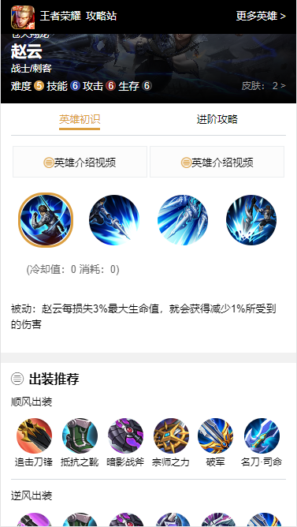

# wzry_project
README.md
系统使用Node.js (Express.js) + Vue.js 开发的仿王者荣耀移动端官网和后台管理

预览地址：http://139.224.18.36/admin

# 运行
1.web端

    web文件夹下
    npm install
    npm run serve

2.admin端

    admin文件夹下
    npm install
    npm run serve

3.server端

    server文件夹下
    npm install
    npm run serve

# 后台管理端
- 页面使用element ui 搭建  
- 编辑页面：对各个模型（表）的操作  
- 列表页面：展示各个模型（表）的数据  
- 管理菜单选项添加动态渲染  
- 路由列表添加动态渲染  
- 页面操作按钮添加权限验证  
- 使用axios拦截器对无权限操作进行拦截  

  
  

    // admin 目录下
    npm install
    npm run serve

# 服务接口端

- 使用MongoDB储存, Mongoose操作数据库模型  
- 模型增删改查使用通用接口  
- 添加登录jwt校验  
- 接口添加登录权限验证  
- 接口添加用户操作权限验证  
```
    // server 目录下
    npm install
    npm run serve
```
# 前台移动端
- 使用flex布局
- 使用scss书写样式  

  
  
```
// web 目录下
npm install
npm run serve
```